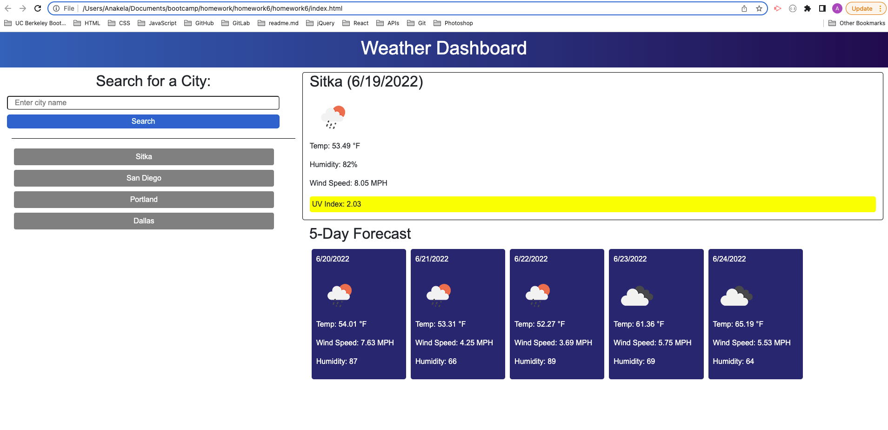

# Homework 6: Server-Side APIs - Weather Dashboard

## Table of Contents

- [Overview](#overview)
  - [The Challenge](#the-challenge)
  - [User Story](#user-story)
  - [Acceptance Criteria](#acceptance-criteria)
  - [Screenshot](#screenshot)
  - [Links](#links)
- [My Process](#my-process)
  - [Built With](#built-with)
  - [What I Learned](#what-i-learned)
  - [Continued Development](#continued-development)
  - [Useful Resources](#useful-resources)
- [Author](#author)
- [Acknowledgments](#acknowledgments)

## Overview

### The Challenge

> Third-party APIs allow developers to access their data and functionality by making requests with specific parameters to a URL. Developers are often tasked with retrieving data from another application's API and using it in the context of their own. Your challenge is to build a weather dashboard that will run in the browser and feature dynamically updated HTML and CSS.

> Use the [OpenWeather One Call API](https://openweathermap.org/api/one-call-api) to retrieve weather data for cities. Read through the documentation for setup and usage instructions. You will use `localStorage` to store any persistent data. For more information on how to work with the OpenWeather API, refer to the [Full-Stack Blog on how to use API keys](https://coding-boot-camp.github.io/full-stack/apis/how-to-use-api-keys).

### User Story

```
AS A traveler
I WANT to see the weather outlook for multiple cities
SO THAT I can plan a trip accordingly
```

### Acceptance Criteria

```
GIVEN a weather dashboard with form inputs
WHEN I search for a city
THEN I am presented with current and future conditions for that city and that city is added to the search history
WHEN I view current weather conditions for that city
THEN I am presented with the city name, the date, an icon representation of weather conditions, the temperature, the humidity, the wind speed, and the UV index
WHEN I view the UV index
THEN I am presented with a color that indicates whether the conditions are favorable, moderate, or severe
WHEN I view future weather conditions for that city
THEN I am presented with a 5-day forecast that displays the date, an icon representation of weather conditions, the temperature, the wind speed, and the humidity
WHEN I click on a city in the search history
THEN I am again presented with current and future conditions for that city
```

### Screenshot



### Links

- Solution URL: [Add solution URL here](https://your-solution-url.com)
- Live Site URL: [Add live site URL here](https://your-live-site-url.com)

## My Process

### Built With

- Semantic HTML5 markup
- CSS
- Bootstrap
- JavaScript
- jQuery

**Note: These are just examples. Delete this note and replace the list above with your own choices**

### What I Learned

Use this section to recap over some of your major learnings while working through this project. Writing these out and providing code samples of areas you want to highlight is a great way to reinforce your own knowledge.

To see how you can add code snippets, see below:

```html
<h1>Some HTML code I'm proud of</h1>
```

```css
.proud-of-this-css {
  color: papayawhip;
}
```

If you want more help with writing markdown, check out [The Markdown Guide](https://www.markdownguide.org/) to learn more.

**Note: Delete this note and the content within this section and replace with your own learnings.**

### Continued Development

Use this section to outline areas that you want to continue focusing on in future projects. These could be concepts you're still not completely comfortable with or techniques you found useful that you want to refine and perfect.

**Note: Delete this note and the content within this section and replace with your own plans for continued development.**

### Useful Resources

- [Convert Milliseconds to a Date using JavaScript](https://bobbyhadz.com/blog/javascript-convert-milliseconds-to-date)
- [EPA's UV Index Scale](https://www.epa.gov/sunsafety/uv-index-scale-0)
- [How to Change the Color of an `<hr>` Element using CSS](https://www.tutorialrepublic.com/faq/how-to-change-the-color-of-an-hr-element-using-css.php)
- [HTML Symbols: Celsius Degrees Symbol](https://www.htmlsymbols.xyz/unicode/U+2103)
- [jQuery: .css()](https://api.jquery.com/css/)
- [jQuery: .show()](https://api.jquery.com/show/)
- [MDN: Date.prototype.toLocaleDateString()](https://developer.mozilla.org/en-US/docs/Web/JavaScript/Reference/Global_Objects/Date/toLocaleDateString)
- [Moment.js](https://momentjs.com/)
- [OpenWeather: One Call API 1.0](https://openweathermap.org/api/one-call-api)
- [OpenWeather: Current Weather Data](https://openweathermap.org/current)
- [Stack Overflow: toLocalDateString() is not returning dd/mm/yyyy format](https://stackoverflow.com/questions/22719346/tolocaledatestring-is-not-returning-dd-mm-yyyy-format)
- [Stack Overflow: Converting milliseconds to a date (jQuery/JavaScript)](https://stackoverflow.com/questions/4673527/converting-milliseconds-to-a-date-jquery-javascript)
- [Stack Overflow: Convert a Unix timestamp to time in JavaScript](https://stackoverflow.com/questions/847185/convert-a-unix-timestamp-to-time-in-javascript)
- [Stack Overflow: What format is this date value in?](https://stackoverflow.com/questions/23576805/what-format-is-this-date-value-in)
- [W3Schools: CSS Gradients](https://www.w3schools.com/css/css3_gradients.asp)
- [W3Schools: HTML Favicon](https://www.w3schools.com/html/html_favicon.asp)

## Author

- LinkedIn - [Angela Soto](https://www.linkedin.com/in/anakela/)
- GitHub - [@anakela](https://github.com/anakela)

## Acknowledgments

- Fellow Bootcampers:
  - Nolan Spence
  - Nifer Kilakila
  - Ivy Chang
  - Asha Chakre
- TAs:
  - Scott Nelson
  - Matthew Kaus
  - Luigi Campbell
- Bobbi Tarkany (Tutor)
